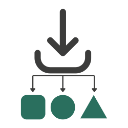

  
  <h1 align="center">DownloadRouter</h1>

**DownloadRouter** is a browser extension that automatically organizes your downloads into specific folders using customizable rules.  
No more messy `Downloads` folder — keep your files sorted the way *you* want.

---

## 🛠 Installation

- Clone or download this repository
- Open your browser’s extensions page:
- - Chrome/Edge: `chrome://extensions/`
- - Firefox: `about:debugging#/runtime/this-firefox`
- Enable Developer Mode
- Click Load unpacked (or Load Temporary Add-on in Firefox)
- Select the project folder
- Done! 🎉

---

Copyright © 2025 Mr Techtroid  
Released Under GPL3.0
